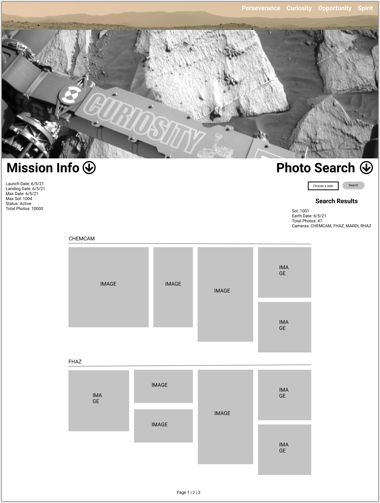

# Mars Rovers

Using the NASA Mars Rover Photos API, the user will enter a date and can retrieve 1 page (25 photos) from either Curiosity, Opportunity or Spirit. The photos will be ordered by camera. These include:
  - FHAZ	(Front Hazard Avoidance Camera)
  - RHAZ	(Rear Hazard Avoidance Camera)
  - MAST	(Mast Camera)
  - CHEMCAM	(Chemistry and Camera Complex)	
  - MAHLI	(Mars Hand Lens Imager)
  - MARDI	(Mars Descent Imager)	
  - NAVCAM	(Navigation Camera)
  - PANCAM	(Panoramic Camera)
  - MINITES	(Miniature Thermal Emission Spectrometer (Mini-TES))

Perseverance rover added and has the following cameras:
  - EDL_RUCAM	(Rover Up-Look Camera)
  - EDL_RDCAM	(Rover Down-Look Camera)
  - EDL_DDCAM	(Descent Stage Down-Look Camera)
  - EDL_PUCAM1	(Parachute Up-Look Camera A)
  - EDL_PUCAM2	(Parachute Up-Look Camera B)
  - NAVCAM_LEFT	(Navigation Camera - Left)
  - NAVCAM_RIGHT	(Navigation Camera - Right)
  - MCZ_RIGHT	(Mast Camera Zoom - Right)
  - MCZ_LEFT	(Mast Camera Zoom - Left)
  - FRONT_HAZCAM_LEFT_A	(Front Hazard Avoidance Camera - Left)
  - FRONT_HAZCAM_RIGHT_A	(Front Hazard Avoidance Camera - Right)
  - REAR_HAZCAM_LEFT	(Rear Hazard Avoidance Camera - Left)
  - REAR_HAZCAM_RIGHT	(Rear Hazard Avoidance Camera - Right)
  - SKYCAM	MEDA (Skycam)
  - SHERLOC_WATSON	(SHERLOC WATSON Camera)

information from the manifest
- general information about the rover - name, landing date, status etc when person is searching (above search bar/before search is made)
- info about searched day - sol, earth date, photos etc

Tech: React, Javascript, HTML, CSS, Netlify, NASA API's (Mars Rover Photos)

---

Website will contain the following pages:
- Landing page: photo of mars and 3 rovers? (gives an indication of what the website is about)
- Curiosity rover: photo of rover
- Opportunity rover: photo of rover
- Spirit rover: photo of rover

- Navbar present on all pages (links to each rover and landing page)
- User can enter a date to retrieve images. Possibly have a drop down menu to select which camera and how many pages they want.

## Rover Pages

SIDEBAR
- Rover mission general information from manifest:

  name: Name of the Rover.  
  landing_date: The Rover's landing date on Mars.  
  launch_date: The Rover's launch date from Earth.  
  status: The Rover's mission status.  
  max_sol: The most recent Martian sol from which photos exist.  
  max_date: The most recent Earth date from which photos exist.  
  total_photos: Number of photos taken by that Rover.  
  
- search area
- manifest information about searched day:

  sol:	Martian sol of the Rover's mission.  
  total_photos:	Number of photos taken by that Rover on that sol.  
  cameras:	Cameras for which there are photos by that Rover on that sol.  
  also list 'earth date'.  

** display 'No images found for searched day' if search returns no images **

MAIN AREA
- Reserved purely for thumbnails
- Group thumbnails by camera
- 25 thumbnails per page with links to next pages

---

## Rover Pages Mockups

### Mobile

- The name of the rover (curiosity in this mockup) and arrow will appear permanently at the bottom of the screen. Clicking arrow will hide/unhide mission info and photo search.

mobile |
---
 |

### Desktop

- Mission info and photo search can be separately hidden/unhidden by clicking the appropriate arrow.

